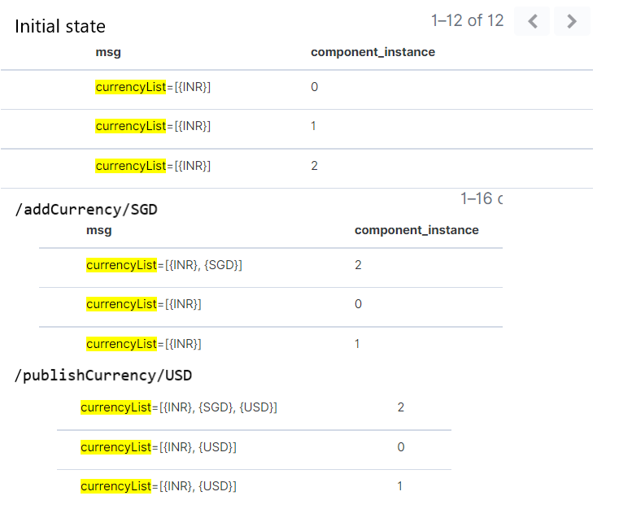

# Multi-instance communication

## Option 1: Redis Pub/Sub
* Redis can be used as a Publisher/Subscriber platform. In this pattern, publishers can issue messages to any number of 
subscribers on a channel. These messages are fire-and-forget, in that if a message is published and no subscribers exists, 
the message evaporates and cannot be recovered.

### POC
* Created a singleton bean that stores some data in each instance
* Created a scheduler that continually print the data from that singleton bean.
* Created 2 API endpoints 
   * `/addCurrency/{curr}`: first one only updates the current instance, without the messaging feature. So the end result will be that the value 
     for 1 instance is updated, the value for the other instance remains the old one 
   * `/publishCurrency/{curr}`: the second API will have the messaging feature, so the end result is that both instances are updated appropriately

#### Screenshots

### Pros
* Broadcasting feature. 
* More than one channel can be subscribed to at a time.

### Cons
* Not reliable - messages are not persisted
* Connection re-establishment in case of disconnection.
* Client must process messages in a timely manner.
* https://support.huaweicloud.com/intl/en-us/ae-ad-1-usermanual-dcs/dcs-faq-0730011.html

## Questions
* Do we need reliability?
* How often our changes would need to be communicated?
* What should be the size of our message? Can it just be an event and the other instances refresh cache using DB?

## Option 2: Using CF - SAP Event Mesh
* https://help.sap.com/viewer/bf82e6b26456494cbdd197057c09979f/Cloud/en-US/df532e8735eb4322b00bfc7e42f84e8d.html
* SAP Event Mesh is a fully managed cloud service that allows applications to communicate through asynchronous events. 
Create responsive applications that work independently and participate in event-driven business processes across your 
business ecosystem for greater agility and scalability.

### Approach
* Publisher can publish messages to different Topics
* Each running instance will create a connection to a queue(subscriber/listener). 
* A queue can subscribe to multiple topics.
* Based on different Topics we can define different flows(for diff data).

## Question
* We need to create/delete a unique queue everytime we create/delete an instance of application.

## Pros
* SAP managed service
* Reliable - The message queue retains messages until the receiving application consumes them.

## Cons
* Scope and limitations are listed here: https://help.sap.com/viewer/bf82e6b26456494cbdd197057c09979f/Cloud/en-US/ac83090b07684f8e908df40d024f8fe5.html