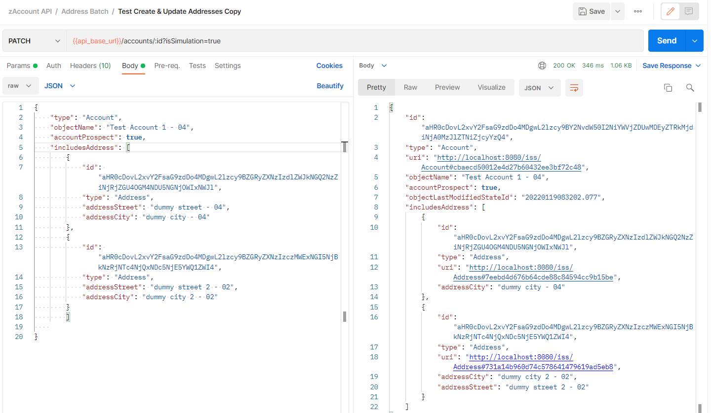
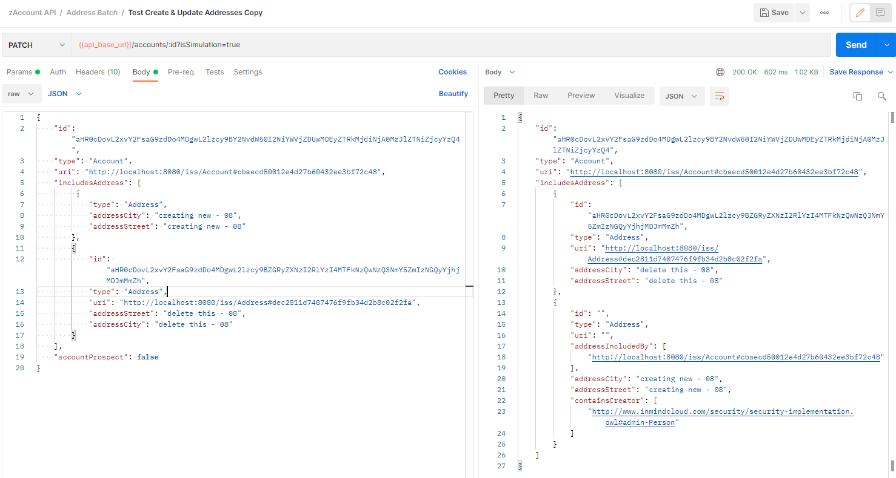

# Product Api changes

* Make changes to the api `@PatchMapping(value = "/{productId}")` to return only the delta. Containing:
   * Changes coming from the payload
   * Any other changes coming from imcscript, triggers or groovy scripts
   
* Add a RequestParam isSimulation to take a boolean value
   * `products/:id?isSimulation=true`
   * Should be defaulted to false
   * false = existing behaviour, should commit to DB
   * true = should not commit and return the delta response.

## Approach
* Using the Processing graph from the context, we can get List of changes in `Triple` format i.e. :
  ```java
    final FlushableDelta processDelta = com.imc.context.Utils.getProcessGraph(ctx);
    final List<Triple> additions = GraphUtil.findAll(processDelta.getAdditions()).toList();
    final List<Triple> deletions = GraphUtil.findAll(processDelta.getDeletions()).toList();
  ```
* And we can use these List to form our result
* [method to create delta response](https://github.com/in-mind-cloud/development/blob/7a785d9a34c4a893ca25c344a1bca8f46137c341/product/iss/core/src/main/java/com/imc/iss/web/services/util/CreateBOFromTriples.java#L338)
* [code changes](https://github.com/in-mind-cloud/development/compare/2202-development...2202-product-api-changes)


## Problems
1. **How to handle the deletions**
   * Currently, in Patch operation we are not performing any deletions.
   * **Proposed Solution:**
      * When deletion is performed, directly commit into the DB.
   * **Example Scenario**
      * step 1: update ERP-id in Account detail
      * step 2: go to address tab and delete(or create) Address(dependent resource).
      * step 3: without hitting save click back button and discard changes.
      * result: Even though we have discarded our changes, the changes are commited to the DB i.e. ERP-id is updated and the address is deleted.
2. **How to handle updating data using multiple endpoints**
   * for example, you update something in the account using `accounts/{id}` api, then update something in the address (using address end point - `accounts/{id}/addresses`), 
   * should we require the previous account changes too to maintain the state?
   * **Proposed Solution**
      * UI need to perform multiple Patch calls i.e one for `accounts/{id}` and the other for `accounts/{id}/addresses`
   * **Question**
      * When we update Address using `accounts/{id}/addresses`, what should be our output format?
      * Because there could be some script which is updating lets say ERP-id while updating some Address. Is it a valid scenario?
       ```json
        {
           "id": "",
           "type: "Address",
           "uri": " http://localhost:8080/iss/Address#ea17eca52e8940e99edc2fd3f2de254e"
           "addressStreet": "New Street - 01"
        }
       ```
     
       OR
       
        ```json
         {
           "id": "",
           "type: "Account",
           "uri": "http://localhost:8080/iss/Account#cbaecd50012e4d27b60432ee3bf72c48"
           "objectName": "Test Account 1 - 01",
           "includesAddress": [
             {
               "id": "",
               "type: "Address",
               "uri": " http://localhost:8080/iss/Address#ea17eca52e8940e99edc2fd3f2de254e"
               "addressStreet": "New Street - 01"
            } 
           ]
         }
       ```
3. **How to handle the cyclic dependents**
    * like includesSalesItem and salesItemIncludedBy or containsQuote vs quoteContainedBy
    * We are forming response from a set of Triples, so, we will not face this problem as we are not retrieving any data.
4. **Creating dependent resources using Patch operation**
    * As of now, if we don't provide id for a child resource(like Address inside Account) it will create it and a random id is generated for it.
    * But when `isSimulation=true` we are not doing a commit to DB, thus that Address doesn't exist in the system.
    * So, if we then pass that delta payload with `isSimulation=false`, it will reject it saying that Address doesn't exist.
    * **Possible Solution**: 
    *  **Solution 1**: remove the id of the created resource from payload.
       * How to identify if the child resource is created or updated?
          * Currently, identifying it if the Addition Triples contains: `Schema.objectId` or `Schema.objectDateOfCreation`
    * **Solution 2**: directly commit it to DB, in case of create


## Use Cases 
1. Use Case 1:
   * Update in primary (details screen, header). Eg - update ERP-id in Account detail screen
   * Update in dependents. Eg - update address in Account
   * Then, save/cancel
2. Use Case 2:
   * Update in primary
   * create/delete in dependents. Eg - create/delete Address
   * Then, save/cancel
3. Use Case 3:
   * Update in primary
   * update in dependents
   * create/delete in dependents
   * Then, save/cancel

## Example Screenshots




