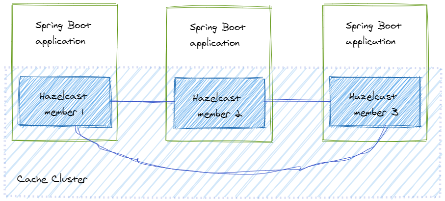
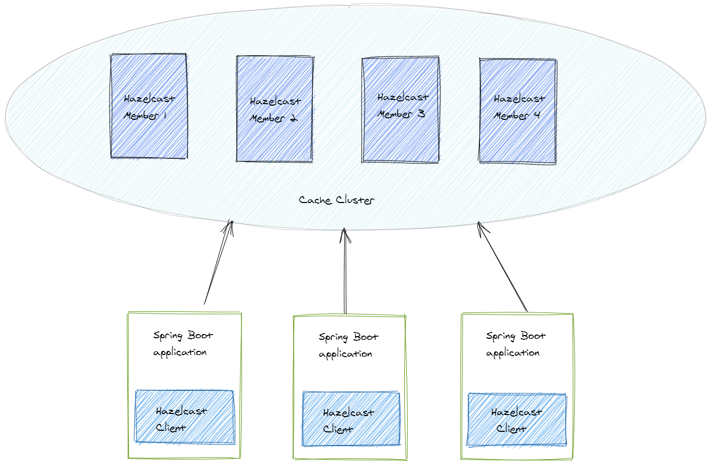

# Distributed Caching

Using a shared cache can help alleviate concerns that data might differ in each cache, 
which can occur with in-memory caching. Shared caching ensures that different application instances see 
the same view of cached data.

There are multiple ways to get a distributed cache; to name a few  
Infinispan, Terracotta/Ehcache, Hazelcast, Memcached, Redis, Cassandra, Elasticache(by Amazon).  
The former three are Java-specific, but the rest can be used in any setup.

## Hazelcast
Hazelcast is a distributed in-memory object store and provides many features including TTL, write-through, and scalability.  
There are two types of topologies we can implement with Hazelcast:
* embedded cache topology, and
* client-server topology.

### Embedded Cache Topology
In this case, the application and the cache data are running on the same node. When a new cache entry is written in the cache,
Hazelcast takes care of distributing it to the other members.

### Client-Server Topology
This topology means that we set up a separate cache cluster, and our application is a client of this cluster.

## Infinispan 
* [Reference](https://infinispan.org/introduction/)
* Distributed in-memory key/value data grid and cache
* It is often used as a distributed cache, but also as a NoSQL key/value store or object database.
* It can be used in embedded mode. When used in this mode, Infinispan instances reside within your JVM alongside your code. 
You start up multiple instances of your application on different servers and each one starts and initializes an Infinispan instance. 
These Infinispan instances discover each other, form a data grid, and start sharing and distributing data.

## Redis cache
Redis is an open source (BSD licensed), in-memory data structure store, used as a database, cache, and message broker. 
Redis provides data structures such as strings, hashes, lists, sets, sorted sets with range queries, bitmaps, hyperloglogs, geospatial indexes, and streams.

### Pros
* A cache server which provides a distributed in-memory database with an extensive command set that supports many common scenarios.
* SAP BTP also supports it. [Reference](https://help.sap.com/viewer/product/Redis/Cloud/en-US)

## Reference

* https://docs.microsoft.com/en-us/azure/architecture/best-practices/caching
* https://www.javacodegeeks.com/2017/04/distributed-cache-overview.html#google_vignette
* https://redis.io/
* https://www.nexsoftsys.com/articles/distributed-caching-in-java-microservices-using-redis-cluster.html
* https://help.sap.com/viewer/product/Redis/Cloud/en-US
* https://reflectoring.io/spring-boot-hazelcast/
* https://en.wikipedia.org/wiki/Distributed_cache